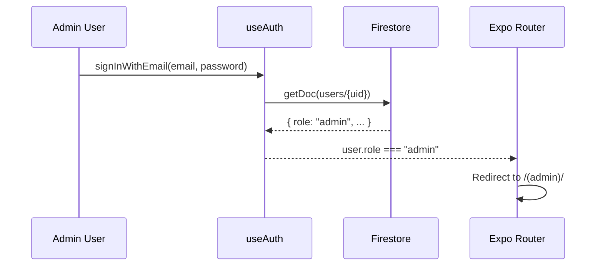
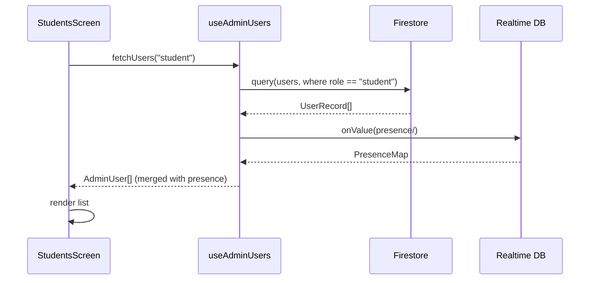
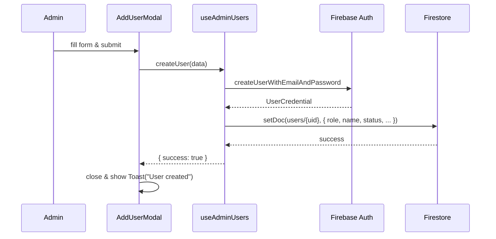
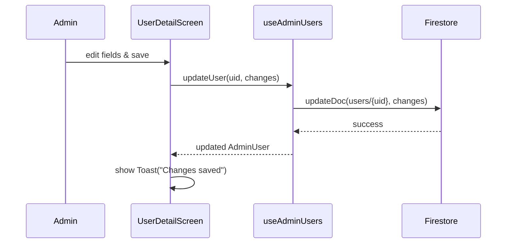
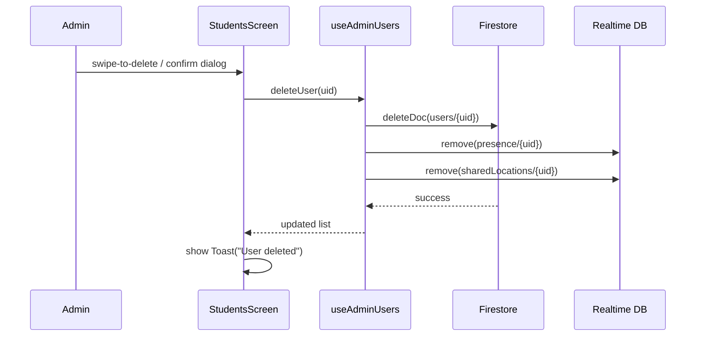

# Design Document: Admin CRUD Panel

## Overview

The Admin CRUD Panel adds a dedicated administrative section to the ForDaGoo app that allows admins to view, create, edit, and delete student and driver user records. Admins can monitor each user's name, account status (active/inactive), and last-known location from a single management interface, without interfering with the existing student/driver tab experience.

The feature introduces a new `admin` role, a protected route group (`app/(admin)/`), a Firestore `admins` collection for role verification, and a `useAdminUsers` hook that wraps all Firestore CRUD operations. The UI follows the existing design language — card-based layouts, `#F56476` accent color, `ThemedText`/`ThemedView` primitives, and the `Toast` component for feedback.

---

## Architecture

```mermaid
graph TD
    A[app/_layout.tsx<br/>Root Stack] --> B[app/auth.tsx<br/>Auth Screen]
    A --> C[app/(tabs)/_layout.tsx<br/>Student / Driver Tabs]
    A --> D[app/(admin)/_layout.tsx<br/>Admin Route Group]

    D --> E[app/(admin)/index.tsx<br/>Dashboard]
    D --> F[app/(admin)/students.tsx<br/>Students List]
    D --> G[app/(admin)/drivers.tsx<br/>Drivers List]
    D --> H[app/(admin)/user-detail.tsx<br/>User Detail / Edit]

    E --> I[useAdminUsers hook]
    F --> I
    G --> I
    H --> I

    I --> J[(Firestore<br/>users collection)]
    I --> K[(Realtime DB<br/>presence / sharedLocations)]

    L[useAuth hook] --> M{role check}
    M -->|admin| D
    M -->|student / driver| C
    M -->|unauthenticated| B
```

---

## Sequence Diagrams

### Admin Login & Role-Based Redirect



### Fetch Users List



### Create User



### Edit User



### Delete User



---

## Components and Interfaces

### Component: `app/(admin)/_layout.tsx`

**Purpose**: Route group layout that guards the admin section. Redirects non-admins away.

**Interface**:
```typescript
// No props — reads from useAuth()
export default function AdminLayout(): JSX.Element
```

**Responsibilities**:
- Read `user.role` from `useAuth`
- Redirect to `/auth` if unauthenticated
- Redirect to `/(tabs)` if role is `student` or `driver`
- Render `<Stack>` with shared admin header style if role is `admin`

---

### Component: `app/(admin)/index.tsx` — Admin Dashboard

**Purpose**: Landing screen showing summary counts and quick-access cards.

**Interface**:
```typescript
export default function AdminDashboard(): JSX.Element
```

**Responsibilities**:
- Display total student count, total driver count, online user count
- Provide navigation cards to Students list and Drivers list
- Show a real-time "online now" badge using presence data

---

### Component: `app/(admin)/students.tsx` & `app/(admin)/drivers.tsx`

**Purpose**: Paginated, searchable list of users filtered by role.

**Interface**:
```typescript
// Receives role via route segment name; no explicit props
export default function StudentsScreen(): JSX.Element
export default function DriversScreen(): JSX.Element
```

**Responsibilities**:
- Render a `FlatList` of `UserCard` components
- Support search by name or email
- Provide "Add" FAB (Floating Action Button) that opens `AddUserModal`
- Support swipe-to-delete with confirmation dialog
- Navigate to `user-detail` on row tap

---

### Component: `app/(admin)/user-detail.tsx`

**Purpose**: View and edit a single user's record.

**Interface**:
```typescript
// Receives uid via router params: useLocalSearchParams<{ uid: string }>()
export default function UserDetailScreen(): JSX.Element
```

**Responsibilities**:
- Display all editable fields: name, email, role, status
- Show read-only fields: UID, createdAt, last location (lat/lng from RTDB)
- Save changes via `updateUser`
- Delete user via `deleteUser` with confirmation

---

### Component: `components/admin/user-card.tsx`

**Purpose**: Reusable list row for a user record.

**Interface**:
```typescript
interface UserCardProps {
  user: AdminUser;
  onPress: (uid: string) => void;
  onDelete: (uid: string) => void;
}

export function UserCard(props: UserCardProps): JSX.Element
```

**Responsibilities**:
- Show avatar (profile icon), name, email, role badge, status dot
- Indicate online/offline via presence data passed in `user.isOnline`
- Show last-known location as a short coordinate string if available

---

### Component: `components/admin/add-user-modal.tsx`

**Purpose**: Modal form for creating a new student or driver account.

**Interface**:
```typescript
interface AddUserModalProps {
  visible: boolean;
  role: 'student' | 'driver';
  onClose: () => void;
  onSuccess: (user: AdminUser) => void;
}

export function AddUserModal(props: AddUserModalProps): JSX.Element
```

**Responsibilities**:
- Collect: name, email, password, role (pre-filled), status
- Validate inputs before submission
- Call `useAdminUsers().createUser()`
- Show inline validation errors and success Toast

---

### Component: `components/admin/status-badge.tsx`

**Purpose**: Small pill badge showing active/inactive status.

**Interface**:
```typescript
interface StatusBadgeProps {
  status: UserStatus;
  size?: 'sm' | 'md';
}

export function StatusBadge(props: StatusBadgeProps): JSX.Element
```

---

## Data Models

### Firestore: `users/{uid}` (extended)

The existing `users` collection is extended with two new fields. All existing fields are preserved.

```typescript
interface UserRecord {
  // --- Existing fields ---
  uid: string;           // document ID
  role: 'student' | 'driver' | 'admin';
  name: string | null;
  email: string | null;
  photoURL: string | null;
  createdAt: Timestamp;
  updatedAt: Timestamp;

  // --- New fields added by this feature ---
  status: 'active' | 'inactive';   // default: 'active'
  lastLocation?: {                  // written by admin or synced from RTDB
    latitude: number;
    longitude: number;
    updatedAt: Timestamp;
  } | null;
}
```

**Validation Rules**:
- `role` must be one of `student`, `driver`, `admin`
- `status` must be one of `active`, `inactive`
- `name` must be non-empty string when provided
- `email` must be valid email format
- `lastLocation.latitude` must be in range `[-90, 90]`
- `lastLocation.longitude` must be in range `[-180, 180]`

---

### Hook Data Type: `AdminUser`

Merged view used by the admin UI, combining Firestore data with real-time presence.

```typescript
interface AdminUser {
  uid: string;
  name: string | null;
  email: string | null;
  photoURL: string | null;
  role: 'student' | 'driver' | 'admin';
  status: UserStatus;
  isOnline: boolean;           // from Realtime DB presence
  lastSeen: number | null;     // timestamp from presence
  lastLocation: {
    latitude: number;
    longitude: number;
  } | null;                    // from Realtime DB sharedLocations or Firestore
  createdAt: Timestamp;
  updatedAt: Timestamp;
}

type UserStatus = 'active' | 'inactive';
```

---

### Hook Input Types

```typescript
interface CreateUserInput {
  name: string;
  email: string;
  password: string;
  role: 'student' | 'driver';
  status: UserStatus;
}

interface UpdateUserInput {
  name?: string;
  status?: UserStatus;
  role?: 'student' | 'driver';
  lastLocation?: { latitude: number; longitude: number } | null;
}
```

---

## Hook: `useAdminUsers`

**File**: `hooks/use-admin-users.ts`

**Purpose**: Encapsulates all Firestore and RTDB operations for the admin panel. Keeps screens thin.

### Interface

```typescript
interface UseAdminUsersReturn {
  // State
  students: AdminUser[];
  drivers: AdminUser[];
  isLoading: boolean;
  error: string | null;

  // CRUD
  fetchUsers: (role: 'student' | 'driver') => Promise<void>;
  createUser: (input: CreateUserInput) => Promise<{ success: boolean; error?: string }>;
  updateUser: (uid: string, input: UpdateUserInput) => Promise<{ success: boolean; error?: string }>;
  deleteUser: (uid: string) => Promise<{ success: boolean; error?: string }>;

  // Utilities
  getUserById: (uid: string) => AdminUser | undefined;
  refreshUsers: () => Promise<void>;
}

export function useAdminUsers(): UseAdminUsersReturn
```

### Key Functions with Formal Specifications

#### `fetchUsers(role)`

```typescript
fetchUsers(role: 'student' | 'driver'): Promise<void>
```

**Preconditions:**
- Caller has `admin` role (enforced by Firestore rules)
- `role` is either `'student'` or `'driver'`

**Postconditions:**
- `students` or `drivers` state is populated with all matching Firestore documents
- Each `AdminUser` has `isOnline` merged from current RTDB presence snapshot
- `isLoading` is `false` after resolution
- On error: `error` state is set, list remains unchanged

---

#### `createUser(input)`

```typescript
createUser(input: CreateUserInput): Promise<{ success: boolean; error?: string }>
```

**Preconditions:**
- `input.email` is a valid, non-empty email string
- `input.password` length ≥ 6
- `input.name` is a non-empty string
- `input.role` ∈ `{ 'student', 'driver' }`

**Postconditions:**
- A new Firebase Auth user is created with `input.email` and `input.password`
- A Firestore document `users/{newUid}` is created with all input fields plus `status`, `createdAt`, `updatedAt`
- The new user appears in the appropriate list (`students` or `drivers`) state
- Returns `{ success: true }` on success
- Returns `{ success: false, error: message }` on any failure; no partial state is left

**Loop Invariants:** N/A

---

#### `updateUser(uid, input)`

```typescript
updateUser(uid: string, input: UpdateUserInput): Promise<{ success: boolean; error?: string }>
```

**Preconditions:**
- `uid` corresponds to an existing Firestore document in `users`
- `input` contains at least one field to update
- If `input.name` is provided, it is a non-empty string

**Postconditions:**
- Firestore document `users/{uid}` is updated with provided fields
- `updatedAt` is set to `serverTimestamp()`
- Local state reflects the updated values immediately (optimistic update)
- Returns `{ success: true }` on success

---

#### `deleteUser(uid)`

```typescript
deleteUser(uid: string): Promise<{ success: boolean; error?: string }>
```

**Preconditions:**
- `uid` corresponds to an existing Firestore document
- Admin cannot delete their own account (uid ≠ currentUser.uid)

**Postconditions:**
- Firestore document `users/{uid}` is deleted
- RTDB nodes `presence/{uid}` and `sharedLocations/{uid}` are removed
- User is removed from local `students` or `drivers` state
- Returns `{ success: true }` on success

---

## Algorithmic Pseudocode

### Main: Fetch & Merge Users

```pascal
ALGORITHM fetchAndMergeUsers(role)
INPUT: role ∈ { 'student', 'driver' }
OUTPUT: AdminUser[]

BEGIN
  SET isLoading ← true
  SET error ← null

  // Step 1: Query Firestore
  firestoreUsers ← query(firestore, 'users', WHERE role == role)

  IF firestoreUsers IS ERROR THEN
    SET error ← "Failed to load users"
    SET isLoading ← false
    RETURN []
  END IF

  // Step 2: Fetch presence snapshot from RTDB
  presenceSnapshot ← getSnapshot(database, 'presence/')
  locationSnapshot ← getSnapshot(database, 'sharedLocations/')

  // Step 3: Merge data
  result ← []
  FOR each fsUser IN firestoreUsers DO
    presence ← presenceSnapshot[fsUser.uid]
    location ← locationSnapshot[fsUser.uid]

    adminUser ← {
      ...fsUser,
      isOnline: presence != null AND (now() - presence.lastSeen) < 2 * 60 * 1000,
      lastSeen: presence?.lastSeen ?? null,
      lastLocation: location != null
        ? { latitude: location.latitude, longitude: location.longitude }
        : fsUser.lastLocation ?? null
    }

    result.add(adminUser)
  END FOR

  // Step 4: Update state
  IF role == 'student' THEN
    SET students ← result
  ELSE
    SET drivers ← result
  END IF

  SET isLoading ← false
  RETURN result
END
```

**Preconditions:**
- Caller is authenticated with `admin` role
- Firestore and RTDB are reachable

**Postconditions:**
- Returned array contains merged `AdminUser` objects
- `isOnline` reflects presence within the last 2 minutes
- `isLoading` is `false`

**Loop Invariants:**
- All previously processed users in `result` are valid `AdminUser` objects

---

### Create User Algorithm

```pascal
ALGORITHM createUser(input)
INPUT: input of type CreateUserInput
OUTPUT: { success: boolean, error?: string }

BEGIN
  // Step 1: Validate
  IF NOT isValidEmail(input.email) THEN
    RETURN { success: false, error: "Invalid email" }
  END IF

  IF length(input.password) < 6 THEN
    RETURN { success: false, error: "Password too short" }
  END IF

  IF isEmpty(input.name) THEN
    RETURN { success: false, error: "Name is required" }
  END IF

  // Step 2: Create Firebase Auth user
  TRY
    credential ← createUserWithEmailAndPassword(auth, input.email, input.password)
    uid ← credential.user.uid
  CATCH authError
    RETURN { success: false, error: authError.message }
  END TRY

  // Step 3: Write Firestore document
  TRY
    setDoc(firestore, 'users/' + uid, {
      uid: uid,
      name: input.name,
      email: input.email,
      role: input.role,
      status: input.status,
      photoURL: null,
      createdAt: serverTimestamp(),
      updatedAt: serverTimestamp()
    })
  CATCH fsError
    // Auth user created but Firestore failed — log for manual cleanup
    RETURN { success: false, error: "User created but profile save failed" }
  END TRY

  // Step 4: Update local state
  newAdminUser ← buildAdminUser(uid, input)
  IF input.role == 'student' THEN
    SET students ← [...students, newAdminUser]
  ELSE
    SET drivers ← [...drivers, newAdminUser]
  END IF

  RETURN { success: true }
END
```

---

### Delete User Algorithm

```pascal
ALGORITHM deleteUser(uid)
INPUT: uid of type string
OUTPUT: { success: boolean, error?: string }

BEGIN
  // Guard: admin cannot delete themselves
  IF uid == currentUser.uid THEN
    RETURN { success: false, error: "Cannot delete your own account" }
  END IF

  // Step 1: Delete Firestore document
  TRY
    deleteDoc(firestore, 'users/' + uid)
  CATCH fsError
    RETURN { success: false, error: fsError.message }
  END TRY

  // Step 2: Clean up RTDB (best-effort, non-blocking)
  TRY
    remove(database, 'presence/' + uid)
    remove(database, 'sharedLocations/' + uid)
  CATCH rtdbError
    // Log but do not fail — Firestore delete already succeeded
    log("RTDB cleanup failed for uid:", uid)
  END TRY

  // Step 3: Update local state
  SET students ← students.filter(u => u.uid != uid)
  SET drivers ← drivers.filter(u => u.uid != uid)

  RETURN { success: true }
END
```

---

## Routing Structure

The admin panel lives in a new Expo Router route group that is completely separate from the existing `(tabs)` group.

```
app/
├── _layout.tsx                  ← adds (admin) to root Stack
├── auth.tsx
├── (tabs)/
│   ├── _layout.tsx              ← student/driver tabs (unchanged)
│   ├── explore.tsx
│   └── profile.tsx
└── (admin)/
    ├── _layout.tsx              ← admin guard + Stack header
    ├── index.tsx                ← Dashboard
    ├── students.tsx             ← Students list
    ├── drivers.tsx              ← Drivers list
    └── user-detail.tsx          ← View / Edit user
```

The root `_layout.tsx` is updated to include `<Stack.Screen name="(admin)" />`.

Role-based redirect logic in `useAuth` is extended:

```typescript
// In app/(tabs)/_layout.tsx — existing redirect
if (user.role === 'admin') {
  return <Redirect href="/(admin)/" />;
}

// In app/(admin)/_layout.tsx — new guard
if (user.role !== 'admin') {
  return <Redirect href="/(tabs)/" />;
}
```

---

## Firestore Security Rules (Updated)

```
rules_version = '2';

service cloud.firestore {
  match /databases/{database}/documents {

    // Helper: check if requester is an admin
    function isAdmin() {
      return request.auth != null
        && get(/databases/$(database)/documents/users/$(request.auth.uid)).data.role == 'admin';
    }

    // Users collection
    match /users/{userId} {
      // Anyone authenticated can read user profiles (existing behaviour)
      allow read: if request.auth != null;

      // Users can write their own document (existing behaviour)
      allow write: if request.auth != null && request.auth.uid == userId;

      // Admins can write any user document (new)
      allow write: if isAdmin();
    }

    // Default deny
    match /{document=**} {
      allow read, write: if false;
    }
  }
}
```

---

## Error Handling

### Error Scenario 1: Non-Admin Access Attempt

**Condition**: A student or driver navigates directly to `/(admin)/`
**Response**: `AdminLayout` reads `user.role`, detects non-admin, immediately redirects to `/(tabs)/`
**Recovery**: Seamless — user lands on their normal home screen

---

### Error Scenario 2: Create User — Email Already Exists

**Condition**: Admin tries to create a user with an email already registered in Firebase Auth
**Response**: `createUser` catches `auth/email-already-in-use`, returns `{ success: false, error: "This email is already registered" }`
**Recovery**: `AddUserModal` displays the error inline; form stays open for correction

---

### Error Scenario 3: Delete User — Firestore Failure

**Condition**: Network error or permission denied during `deleteDoc`
**Response**: `deleteUser` returns `{ success: false, error: message }`; local state is NOT modified
**Recovery**: Toast shows error message; user record remains in the list

---

### Error Scenario 4: Firestore Rules Deny Admin Write

**Condition**: Admin's Firestore token is stale or rules misconfigured
**Response**: Operation throws `permission-denied`; hook catches and returns error
**Recovery**: Toast prompts admin to re-login; no data corruption

---

### Error Scenario 5: RTDB Cleanup Fails on Delete

**Condition**: RTDB is unreachable when deleting a user
**Response**: Firestore delete succeeds; RTDB cleanup is logged but does not block success response
**Recovery**: Stale RTDB entries expire naturally (presence TTL: 2 min, location TTL: 5 min)

---

## Testing Strategy

### Unit Testing Approach

Test the `useAdminUsers` hook in isolation using `@testing-library/react-hooks` with mocked Firebase modules.

Key test cases:
- `fetchUsers('student')` populates `students` and sets `isLoading: false`
- `createUser` with valid input creates Auth user and Firestore doc
- `createUser` with invalid email returns `{ success: false }`
- `deleteUser` removes Firestore doc and RTDB nodes
- `deleteUser` with own UID returns `{ success: false, error: "Cannot delete your own account" }`
- `updateUser` with empty `input` returns error without writing to Firestore

### Property-Based Testing Approach

**Property Test Library**: `fast-check`

Properties to verify:

1. **Create-then-fetch consistency**: For any valid `CreateUserInput`, after `createUser(input)` succeeds, `fetchUsers(input.role)` returns a list containing a user with matching `email` and `name`.

2. **Delete idempotency**: After `deleteUser(uid)` succeeds, calling `deleteUser(uid)` again returns `{ success: false }` (document no longer exists).

3. **Update non-destructive**: For any `UpdateUserInput` that only sets `status`, all other fields of the user remain unchanged after `updateUser`.

4. **Status badge invariant**: For any `AdminUser`, `StatusBadge` renders without error for all values of `UserStatus` (`'active'`, `'inactive'`).

### Integration Testing Approach

Use Firebase Emulator Suite (Firestore + Auth + RTDB emulators) for integration tests:

- Full create → list → edit → delete lifecycle for a student
- Full create → list → edit → delete lifecycle for a driver
- Admin role guard: verify non-admin UID cannot write to `users/{otherUid}` via Firestore rules
- Presence merge: verify `isOnline` is `true` when RTDB presence entry exists and `false` when absent

---

## Performance Considerations

- **Pagination**: The `fetchUsers` query uses Firestore `limit(50)` with cursor-based pagination (`startAfter`) to avoid loading all users at once.
- **Real-time listeners**: Presence and location data use `onValue` listeners scoped to the admin screens only; listeners are detached on screen unmount to avoid memory leaks.
- **Optimistic updates**: `updateUser` and `deleteUser` update local state immediately before the Firestore call resolves, keeping the UI responsive.
- **Search debounce**: The search input in the list screens debounces at 300 ms to avoid re-filtering on every keystroke.
- **FlatList**: User lists use `FlatList` with `keyExtractor` and `getItemLayout` for smooth scrolling on large datasets.

---

## Security Considerations

- **Role enforcement is server-side**: Firestore security rules verify the `admin` role on every write. Client-side role checks (redirect in `_layout.tsx`) are UX-only and not a security boundary.
- **Admin cannot self-delete**: `deleteUser` guards against `uid === currentUser.uid` to prevent accidental lockout.
- **Password handling**: Passwords for new users are never stored in Firestore; they are passed directly to Firebase Auth and discarded.
- **Firestore rule for admin writes**: The `isAdmin()` helper reads the requester's own Firestore document to verify role, preventing role spoofing via client-side token manipulation.
- **No bulk delete**: The UI exposes single-record deletion only, reducing blast radius of accidental deletes.
- **Audit trail**: `updatedAt` is always set to `serverTimestamp()` on every write, providing a basic audit trail.

---

## Dependencies

| Dependency | Already in Project | Purpose |
|---|---|---|
| `firebase/firestore` | ✅ | User CRUD operations |
| `firebase/auth` | ✅ | Create new user accounts |
| `firebase/database` | ✅ | Read presence & location for merge |
| `expo-router` | ✅ | File-based routing for `(admin)` group |
| `react-native` FlatList | ✅ | Performant user lists |
| `ThemedText`, `ThemedView` | ✅ | Consistent UI primitives |
| `Toast` component | ✅ | User feedback on CRUD operations |
| `ProfileIcon` component | ✅ | User avatars in list rows |
| `fast-check` | ❌ (new) | Property-based testing |
